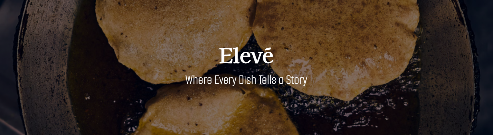

**Elevé** is a fine-dining website that offers users an easy way to explore our menu, make reservations, and manage their dining experience. Below is a detailed description of each page on the site.

### Home
- **Promotions**: Displays current promotions and special offers from `promotions` table.
- **Testimonials**: Showcases customer feedback and reviews from `testimonials` table.
### Menu
- **Appetizers**: Displays a list of appetizers, retrieved from the `appetizers` table.
- **Mains**: Displays a list of main courses, retrieved from the `entree` table.
- **Desserts**: Displays a list of desserts, retrieved from the `desserts` table.
- **Drinks**: Displays a list of drinks, retrieved from the `drinks` table.

### Reserve
- **Reservation Form**: Allows users to add a new reservation.
- **Location Section**: Shows available locations, retrieved from the `locations` table.

### Manage
- **Reservations**
  - **Read**: Displays all current reservations.
  - **Update**: Allows updating of existing reservations.
  - **Delete**: Allows deletion of existing reservations.
- **Locations**
  - **Read**: Displays all locations.
  - **Update**: Allows updating of existing location information.
- **Promotions**
  - **Read**: Displays current promotions.
  - **Update**: Allows updating of current promotions.
  - **Delete**: Allows deletion of current promotions.
